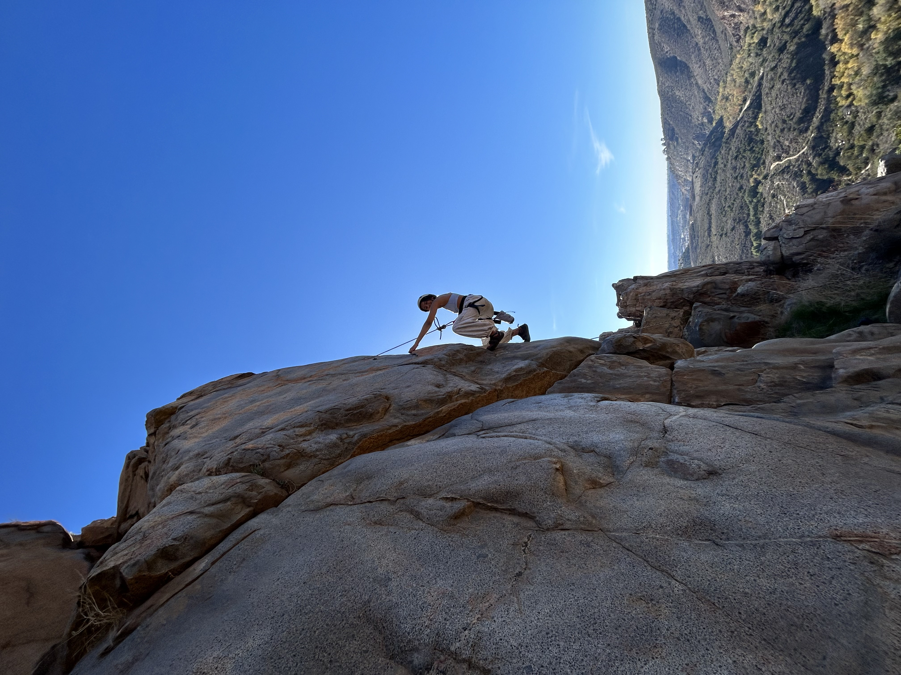

# Saumya Sadh's User Page

## 📸 About Me

Hi! My name is **Saumya Sadh**, I am a senior double majoring in **Mathematics-Computer Science** and **Business Economics** with a minor in **Finance**. I love learning new things all the time and like challenging myself.

Outside of academics, I really enjoy **adventure sports**. I am a certified **advanced scuba diver** and **freediver**, and I also really enjoy **rock climbing**!  
🎮 *Mario Kart* and *FIFA* are my favorite video games, and I love reading books about **finance** and **programming**.



## 📚 Skills

- Python
- Git & GitHub
- Markdown
- VS Code

## 🔥 Quote 

> "The happiness of your life depends on the quality of your thoughts"
> - Marcus Aurelius


## 💻 Sample Code

```python
def hello():
    print("Hello, GitHub Pages!")
```

[Link to the photo → IMG_1291.jpeg](IMG_1291.jpeg)  
*(Relative link to image as a file)*

[Jump to Skills](#-skills)  
*(Section link within this file)*

[View GitHub](https://github.com)  
*(External link to another website)*

## 🔢 What I Did (Ordered List)

1. Created GitHub repo
2. Cloned it locally
3. Created branches
4. Edited files
5. Committed & pushed

---

## 🔸 Random Facts (Unordered List)

- Love climbing!
- Read a lot about investing
- Big fan of open-source
- Code best with coffee ☕️

### 🛠️ Task List

- [x] Set up GitHub Pages
- [x] Add README
- [ ] Finish Markdown assignment


